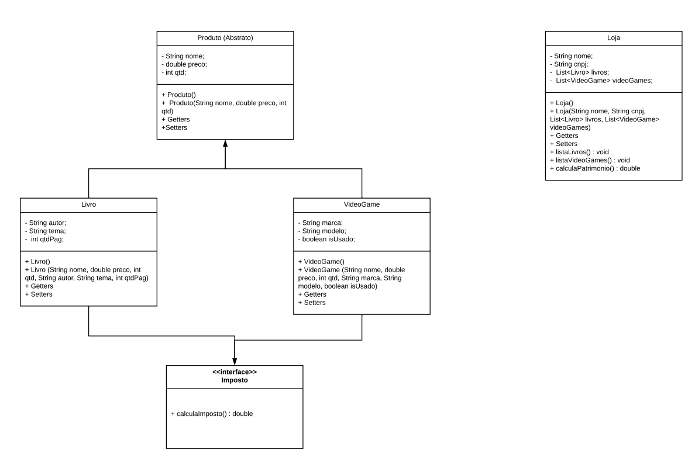

<h1 align="center">Semana 01 - POO</h1>

Implementações de exercícios de programação de Programação Orientada a Objetos propostos na Semana 01 do treinamento Starter .NET 

---
## :memo: Descrição dos exercícios 

## Exercício 01

Seguindo o diagrama UML a seguir, implemente a classe Veiculo e seus
métodos. Após a implementação, testar cada um dos métodos via console.

- acelerar(): este método acrescenta um valor de +20 no atributo
velocidade.
- abastecer(int combustivel): recebe como parâmetro uma quantidade de
combustível e atribui a listrosCombustivel. OBS.: O limite do tanque de
combustível é de 60 litros, validar para não ultrapassar.
- frear(): a cada chamada do método diminui a velocidade em 20. Não
aceitar a chamada do método se o veiculo estiver parado.
- pintar(String cor): recebe uma cor como parâmetro e altera o atributo.
- ligar(): Verifica se o veículo já se encontra ligado, caso não, liga o carro.
- desligar(): Verifica se o veículo já se encontra desligado, caso não, desliga
o carro. Não permitir que desligue o veículo com (velocidade > 0).

UML Exercício 01 

[Visualizar Código](https://github.com/CarolineMano/estudo-poo/tree/master/Exercicio01)  

---

## Exercício 02

Seguindo o diagrama UML a seguir, implemente as classes, interfaces e as
saídas do programa. Após a implementação, testar cada um dos métodos via
console.

UML Exercício 02 

**Descrição dos Métodos**  
1. CalculaImposto(): método para calcular imposto sobre um produto com a seguinte regra:
    1. Livros:
    - Se o livro for de tema = "educativo", não se deve cobrar imposto, retornar 0.
    - Caso seja de qualquer outro tema, calcular imposto de 10% sobre o preço do livro.
    2. Videogame:
    - Se o videogame for usado, calcular imposto de 25% sobre o preço do videogame.
2. ListaLivros(): lista todos os livros que uma loja tem, caso a lista de livros seja vazia, mostrar no console "A loja não tem livros no seu estoque.".
3. ListaVideoGames(): lista todos os games que uma loja tem, caso a lista de videogames esteja vazia, mostrar no console "A loja não tem video-games no seu estoque.".
4. CalculaPatrimonio(): soma os preços de todos os produtos da loja e retorna este valor como double.

[Visualizar Código](https://github.com/CarolineMano/estudo-poo/tree/master/Exercicio02)  

---

## Exercício 03

Seguindo o diagrama UML, implemente as classes e exiba no console
conforme a imagem a seguir:

UML Exercício 03 

1. Usando o conceito de polimorfismo, implemente o método LvlUp(), de
forma que o Mago ao subir de nível possua um aumento maior nos
atributos Mana e Inteligência e o Guerreiro possua um aumento maior nos
atributos Vida e Força.

2. Implemente o método attack() de forma que siga a seguinte regra:
    - Mago: ( Inteligência * Level ) + numeroRandomico( 0 até 300 ).
    - Guerreiro: ( Força * Level ) + numeroRandomico( 0 até 300 ).

[Visualizar Código](https://github.com/CarolineMano/estudo-poo/tree/master/Exercicio03)  

---

## Exercício 04

Instancie o objeto e a Lista<Pessoa>, adicione os dados conforme a tabela
abaixo e por fim imprima o nome da pessoa mais velha.

Nome | Idade
------------ | -------------
João | 15
Leandro | 21
Paulo | 17
Jessica | 18

[Visualizar código](https://github.com/CarolineMano/estudo-poo/tree/master/Exercicio04)

---

## Exercício 05

Aproveitando a questão anterior (4) - Exclua da Lista as pessoas com idade
inferior a 18 anos. E exiba a quantidade da lista antes e depois da
exclusão. (Não reescreva o código do item 01).

**Atenção! Como o exercício 05 é uma continuação do exercício 04, não há arquivo separado. A implementação se encontra dentro do exercício 04**

[Visualizar código](https://github.com/CarolineMano/estudo-poo/tree/master/Exercicio04)

---

## Exercício 06

Aproveitando – o seu código já escrito na questão (4) e na Questão (5) –
Consulte se o objeto Jessica existe na lista e exiba a sua idade.

**Atenção! Como o exercício 06 é uma continuação do exercício 04, não há arquivo separado. A implementação se encontra dentro do exercício 04**

[Visualizar código](https://github.com/CarolineMano/estudo-poo/tree/master/Exercicio04)

---

## Exercício 07

Considerando os conceitos de Orientação a Objetos, crie uma classe Pai de
nome Funcionário com os seguintes atributos (nome, idade e salário) e mais
três classes Filhas (Gerente, Supervisor e Vendedor). Na classe Funcionário
deve existir um método de nome bonificação que retorna o salário, nas
classes filhas deve existir o mesmo método bonificação porem com as
seguintes regras:

- Para Gerente, o método bonificação deve retornar o salário + 10000.00;
- Para Supervisor, o método bonificação deve retornar o salário + 5000.00;
- Para Vendedor, o método bonificação deve retornar o salário + 3000.00;

Por fim, criar uma classe principal que instancie objetos de Gerente,
Supervisor e Vendedor e adicione no mínimo um valor para cada atributo e
imprima cada funcionário (Gerente, Supervisor e Vendedor) com suas devidas
bonificações.

[Visualizar código](https://github.com/CarolineMano/estudo-poo/tree/master/Exercicio07)